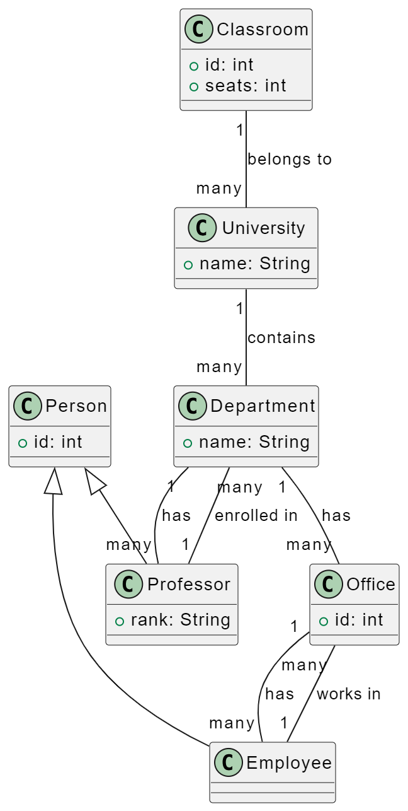
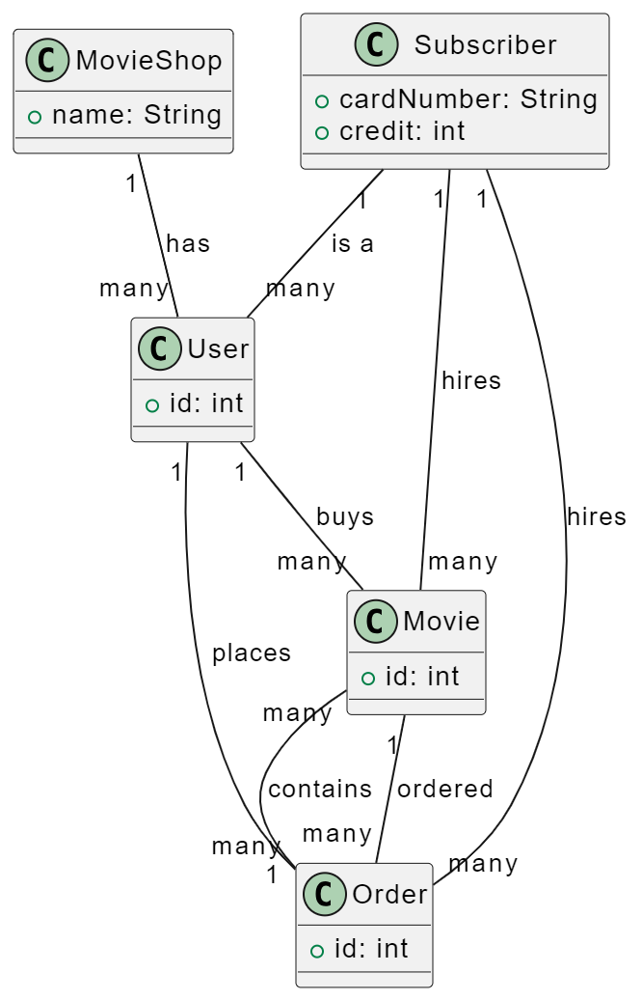

# SENG_415_Software-Modeling-and-Design

### Class Diagrams 1. University

▰ In a university there are different classrooms, offices and departments. A department has a name and it contains many offices. A person working at the university has a unique ID and can be a professor or an employee.

▰ A professor can be a full, associate or assistant professor and he/she is enrolled in one department.

▰ Offices and classrooms have a number ID, and a classroom has a number of seats.

▰ Every employee works in an office.

### Class Diagrams 2. Movie- Shop
▰ Design a system for a movie-shop, in order to handle ordering of movies and browsing of the catalogue of the store, and user subscriptions with rechargeable cards.

▰ Only subscribers are allowed hiring movies with their own card.

▰ Credit is updated on the card during rent operations.

▰ Both users and subscribers can buy a movie and their data are saved in the related order.

▰ When a movie is not available it is ordered .

